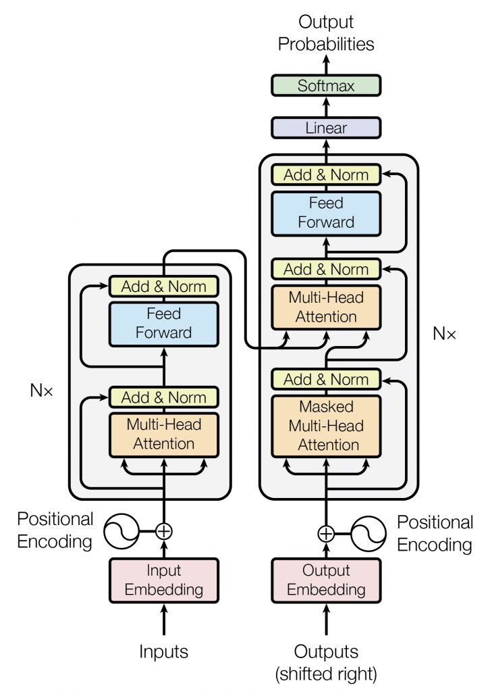

# Vanilla Transformer

PyTorch implementation of the original transformer paper ([Vaswani et al.](https://arxiv.org/abs/1706.03762)).

 

    

 

## Dataset

`english_dataset.txt` and `spanish_dataset.txt` are a selection of sentence pairs from the Tatoeba Project. See the repository [Tab-delimited Bilingual Sentence Pairs](http://www.manythings.org/anki). We have preprocessed the words to make them lowercase and remove special characters.

## Modifications and Comments

- The position of Layer Normalization matters. Check paper [Xiong et al.](https://arxiv.org/abs/2002.04745)

## TODO

- Learning rate Scheduler: We are using ADAM with a learning rate of 0.0001.
- Train and test model in a real dataset.
- BLEU metric.
- Beam Search.
